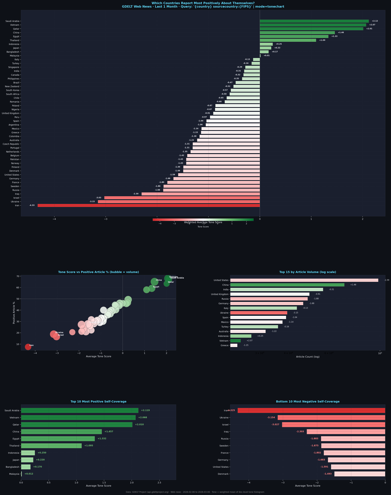

# GDELT Global Media Tone Analysis

Country-to-country news coverage sentiment analysis using [GDELT](https://www.gdeltproject.org/) data.

**[→ Live Website](website/index.html)** — interactive heatmap, rankings, and country explorer.



## What it does

Analyzes how 50 countries cover each other in news media, measuring the **average tone** (positive/negative sentiment) of articles from country A mentioning country B.

**Key findings:**
- Vietnam, Saudi Arabia, and China report most positively about themselves
- Ukraine, Iran, and Qatar report most negatively about themselves
- Most hostile pair: Czech Republic → Pakistan (-7.71)
- US → China: -1.28 (negative), China → US: -1.09 (negative)

## Data sources

| Source | Coverage | Accuracy |
|--------|----------|----------|
| [GDELT API](https://api.gdeltproject.org) | 659 country pairs | High (exact `sourcecountry` metadata) |
| [GDELT BigQuery](https://cloud.google.com/bigquery) + [SCImago](https://www.scimagomedia.com) | 1,753 pairs | Medium (domain→country mapping) |

Final dataset: `results/merged_coverage.csv` (2,412 pairs, 50 countries)

## Pipeline

```
GDELT API scraper          →  results/cross_coverage/cache.json   (702 pairs)
GDELT BigQuery v5          →  results/bigquery_v5/cross_coverage.csv
SCImago domain mapping     →  results/scimago_domain_country.csv
                                        ↓
                           results/merged_coverage.csv  (API preferred)
                                        ↓
                           website/index.html
```

## Setup

```bash
python3 -m venv venv && source venv/bin/activate
pip install pandas requests google-cloud-bigquery openpyxl
```

**For BigQuery:** set your GCP project ID in `gdelt_bigquery_v5.py` and run:
```bash
gcloud auth application-default login
```

## Scripts

| Script | Purpose |
|--------|---------|
| `gdelt_self_coverage_tone.py` | Scrape self-coverage tone for 50 countries via GDELT API |
| `gdelt_cross_coverage.py` | Scrape all 50×50 country pairs via GDELT API |
| `gdelt_bigquery_v5.py` | BigQuery query using SCImago domain mapping |
| `geolocate_domains.py` | Alternative: IP-based domain→country mapping |
| `visualize.py` | Self-coverage dashboard chart |
| `visualize_matrix.py` | 50×50 heatmap (static PNG) |
| `build_website.py` | Rebuild `website/index.html` with latest data |

## Website

Open `website/index.html` directly in a browser (no server needed). To rebuild after updating data:

```bash
python3 build_website.py
```
